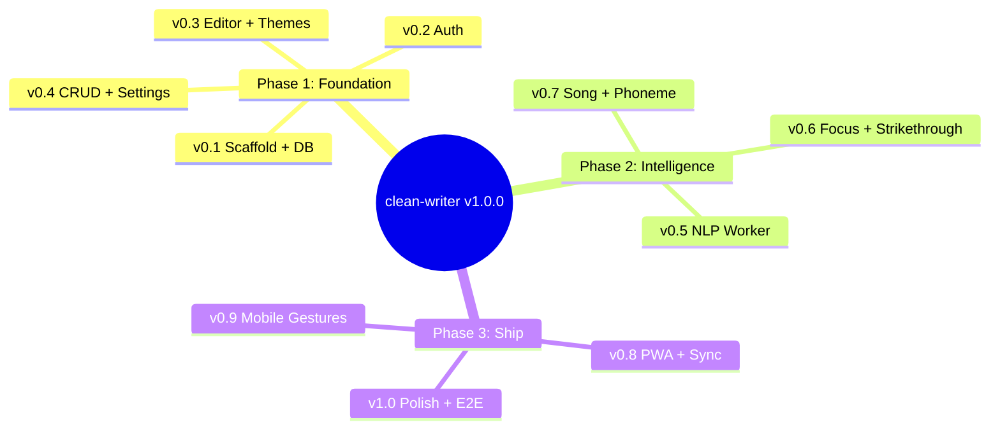

# Clean Writer — RedwoodJS Full-Stack Rewrite

## Context

Clean Writer is a sophisticated distraction-free writing PWA (`~/Desktop/clean-writer`) built with React 19 + Vite. It stores all data in 28 localStorage keys with zero server dependencies. The app has 13 themes, 12 NLP syntax highlight types, song mode (rhyme/syllable analysis), phoneme mode, focus mode, and full offline PWA support.

**Why rewrite:** Move from client-only to full-stack architecture with user accounts, PostgreSQL persistence, multi-device sync, and proper auth — while preserving every existing feature. The current monolithic 1445-line `App.tsx` needs decomposition into a maintainable, scalable architecture.

**Target:** v1.0.0 semantic release at `~/Desktop/redwood-rewrite-clean-writer`. Gradual 3-phase rollout. OpenSpec workflow. 5x parallel agents across architectural layers.



---

## Architecture

### Tech Stack
- **Framework:** RedwoodJS (latest stable, TypeScript)
- **Database:** PostgreSQL via Prisma (Railway managed)
- **Auth:** Redwood dbAuth (cookie-based, 10-year expiry)
- **Deploy:** Railway (full-stack hosting + Postgres)
- **NLP:** Client-side Web Worker (Compromise.js + CMU dictionary — unchanged)
- **Offline:** localStorage write-ahead cache → async sync to PostgreSQL
- **Styling:** Tailwind CSS + golden ratio spacing system

### 5-Layer Architecture

```
CLIENT (Browser)                        SERVER (RedwoodJS API)
┌──────────────────────┐               ┌──────────────────────┐
│  PRESENTATION        │               │  DATA (GraphQL)      │
│  Pages, Cells,       │               │  SDL, Services,      │
│  Components, Layouts │               │  Resolvers           │
│         ↕            │               │         ↕            │
│  STATE               │               │  SYNC                │
│  React Context,      │  ◄─ HTTPS ──► │  Conflict Resolution,│
│  Hooks, Web Workers  │               │  Version Control,    │
│         ↕            │               │  Migration           │
│  STORAGE (Local)     │               │         ↕            │
│  localStorage WAL,   │               │  STORAGE (Postgres)  │
│  Service Worker      │               │  Prisma ORM          │
└──────────────────────┘               └──────────────────────┘
```

---

## Prisma Schema

### Models

**User** — dbAuth compatible
```prisma
model User {
  id                  String    @id @default(cuid())
  email               String    @unique
  hashedPassword      String
  salt                String
  resetToken          String?
  resetTokenExpiresAt DateTime?
  createdAt           DateTime  @default(now())
  updatedAt           DateTime  @updatedAt
  deletedAt           DateTime?
  documents           Document[]
  settings            UserSettings?
  customThemes        CustomTheme[]
  themeConfig         ThemeConfig?
}
```

**Document** — content + versioning for sync
```prisma
model Document {
  id              String    @id @default(cuid())
  userId          String
  user            User      @relation(fields: [userId], references: [id], onDelete: Cascade)
  title           String    @default("Untitled")
  content         String    @default("") @db.Text
  version         Int       @default(1)
  checksum        String?
  wordCount       Int       @default(0)
  charCount       Int       @default(0)
  createdAt       DateTime  @default(now())
  updatedAt       DateTime  @updatedAt
  deletedAt       DateTime?
  lastSyncedAt    DateTime?
  clientUpdatedAt DateTime?
  snapshots       DocumentSnapshot[]
  @@index([userId, deletedAt])
  @@index([userId, updatedAt])
}
```

**DocumentSnapshot** — version history for conflict recovery
```prisma
model DocumentSnapshot {
  id         String   @id @default(cuid())
  documentId String
  document   Document @relation(fields: [documentId], references: [id], onDelete: Cascade)
  content    String   @db.Text
  version    Int
  checksum   String
  wordCount  Int      @default(0)
  createdAt  DateTime @default(now())
  @@index([documentId, version])
}
```

**UserSettings** — all 28 localStorage preference keys in one row
```prisma
model UserSettings {
  id                     String   @id @default(cuid())
  userId                 String   @unique
  user                   User     @relation(fields: [userId], references: [id], onDelete: Cascade)
  maxWidth               Int      @default(800)
  activeThemeId          String   @default("classic")
  fontId                 String   @default("courier-prime")
  fontSizeOffset         Int      @default(0)
  lineHeight             Float    @default(1.6)
  letterSpacing          Float    @default(0)
  paragraphSpacing       Float    @default(0.5)
  highlightConfig        Json     @default("{\"nouns\":true,\"pronouns\":true,\"verbs\":true,\"adjectives\":true,\"adverbs\":true,\"prepositions\":true,\"conjunctions\":true,\"articles\":true,\"interjections\":true,\"urls\":true,\"numbers\":true,\"hashtags\":true}")
  viewMode               String   @default("write")
  focusMode              String   @default("none")
  soloMode               String?
  syllableAnnotations    Boolean  @default(true)
  rhymeHighlightRadius   Int      @default(4)
  rhymeBoldEnabled       Boolean  @default(true)
  utf8DisplayEnabled     Boolean  @default(false)
  seenSyntaxPanel        Boolean  @default(false)
  mobileWelcomeSeen      Boolean  @default(false)
  breakdownCollapsed     Boolean  @default(false)
  songRhymesCollapsed    Boolean  @default(false)
  songLinesCollapsed     Boolean  @default(true)
  wordTypeOrder          Json?
  themeOverrides         Json     @default("{}")
  themeNames             Json     @default("{}")
  lastSyncedAt           DateTime?
  clientUpdatedAt        DateTime?
  updatedAt              DateTime @updatedAt
}
```

**CustomTheme** — user-created themes (max 20)
```prisma
model CustomTheme {
  id                 String   @id
  userId             String
  user               User     @relation(fields: [userId], references: [id], onDelete: Cascade)
  name               String
  textColor          String
  backgroundColor    String
  accentColor        String
  cursorColor        String
  strikethroughColor String
  selectionColor     String
  highlightColors    Json
  rhymeColors        Json?
  sortOrder          Int      @default(0)
  createdAt          DateTime @default(now())
  updatedAt          DateTime @updatedAt
  deletedAt          DateTime?
  lastSyncedAt       DateTime?
  clientUpdatedAt    DateTime?
  @@index([userId, deletedAt])
  @@index([userId, sortOrder])
}
```

**ThemeConfig** — visibility and ordering
```prisma
model ThemeConfig {
  id                      String   @id @default(cuid())
  userId                  String   @unique
  user                    User     @relation(fields: [userId], references: [id], onDelete: Cascade)
  hiddenThemeIds          Json     @default("[]")
  themeOrder              Json     @default("[]")
  hasCustomizedVisibility Boolean  @default(false)
  lastSyncedAt            DateTime?
  clientUpdatedAt         DateTime?
  updatedAt               DateTime @updatedAt
}
```

---

## Offline Sync Strategy

### Write Path
1. User action → React state update → **immediate** localStorage write
2. SyncManager.enqueue() adds entry to localStorage WAL
3. If online: debounced flush (2s) sends batch via GraphQL `syncBatch` mutation
4. If offline: queue stays in localStorage, flushes on `window.online` event

### Conflict Resolution
| Entity | Strategy | Rationale |
|--------|----------|-----------|
| UserSettings | Last-write-wins (clientUpdatedAt) | Low risk, atomic object |
| ThemeConfig | Last-write-wins (clientUpdatedAt) | Low risk |
| CustomTheme | Last-write-wins (clientUpdatedAt) | Small, rarely conflicting |
| Document | Server-wins + local stash | High-value content; local version saved as DocumentSnapshot |

### Sync Triggers
1. `window.online` event — immediate flush
2. Debounced on write (2s) — when online
3. Periodic heartbeat (30s) — catches edge cases
4. `visibilitychange` — when user switches back to tab
5. `beforeunload` — `navigator.sendBeacon` for critical data

### Migration Path
On first authenticated load with no UserSettings record:
1. Read all 28 legacy localStorage keys
2. Create UserSettings, Document, CustomThemes, ThemeConfig via GraphQL mutations
3. Mark `cw_migration_completed` in localStorage
4. Legacy keys continue serving as write-ahead cache

---

## Frontend Architecture

### Routes
```
/              → HomePage (landing, unauthenticated)
/login         → LoginPage (dbAuth)
/signup        → SignupPage (dbAuth)
/forgot-password → ForgotPasswordPage
/reset-password  → ResetPasswordPage
/write         → WriterPage (Private, authenticated)
```

### Page Composition (WriterPage)
```
WriterLayout (applies theme, provides auth context)
  └── UserSettingsCell (fetches settings, provides WriterContext)
      └── UserThemesCell (fetches custom themes)
          └── ActiveDocumentCell (fetches active document)
              └── WriterContainer
                  ├── Typewriter (forward-only editor + syntax overlay)
                  ├── Toolbar (actions, word count, theme selector)
                  └── UnifiedSyntaxPanel (desktop panel / mobile harmonica)
```

### Component Decomposition (from monolithic App.tsx)

**Cells (RedwoodJS data-fetching pattern):**
- `ActiveDocumentCell` — QUERY + Loading/Empty/Failure/Success
- `UserSettingsCell` — settings with upsert on first load
- `UserThemesCell` — custom themes list
- `ThemeOverridesCell` — per-theme color overrides

**Context Providers:**
- `WriterContext` — document content, syntax data, transient UI state
- `ThemeContext` — resolved theme (preset + overrides + custom)

**Components (migrated from current):**
- Core: `Typewriter`, `TypewriterOverlay`, `TypewriterCursor`
- Toolbar: `Toolbar`, `ActionButtons`, `WordCount`, `ThemeSelector`, `Icons`
- Panel: `DesktopSyntaxPanel`, `HarmonicaContainer`, `PanelBody`, `CornerFoldTab`, `FoldContainer`, `SyntaxToggles`, `SyntaxLegend`, `WordCountReceipt`
- Analysis: `SongModePanel`, `PhonemePanel`, `FocusMode`, `AnalysisDrawer`
- Preview: `MarkdownPreview`
- Theme: `ThemeCustomizer`, `SaveThemeForm`, `ColorPicker`
- UI: `Toast`, `ConfirmDialog`, `Tooltip`, `TouchButton`, `Kbd`, `HelpModal`
- Mobile: `MobileWelcome`, `AnimatedTrashBin`, `DragGhost`

**Hooks (14 migrated + 2 new):**
- Migrated: `useAppHotkeys`, `useBlinkCursor`, `useCustomTheme`, `useCustomThemes`, `useFocusNavigation`, `useHarmonicaDrag`, `useIMEComposition`, `useMobileEditState`, `useResponsiveBreakpoint`, `useSelectionPersistence`, `useSyntaxWorker`, `useThemeVisibility`, `useTouch`, `useVirtualKeyboard`
- New: `useOfflineSync`, `useOnlineStatus`

**Workers (unchanged, client-side):**
- `syntaxWorker.ts` — Compromise.js NLP + CMU dictionary
- `songAnalysisService.ts` — syllable/rhyme/scheme analysis
- `phonemeService.ts` — character-level phonemic classification

**Services (client-side):**
- `localSyntaxService.ts` — client-side syntax processing (countWords, analyzeSyntax)

**Utils (direct copy):**
- `colorContrast.ts`, `colorHarmony.ts`, `contrastAwareColor.ts`, `emojiUtils.ts`, `oklch.ts`, `overlapDebug.ts`, `strikethroughUtils.ts`, `syntaxPatterns.ts`, `textSegmentation.ts`, `themeColorGenerator.ts`

**Note on debounce timings:** Auto-save writes to localStorage at 300ms debounce (local persistence). The SyncManager flushes to the server at 2s debounce (network sync). These are distinct mechanisms operating at different layers.

**Note on ThemeOverridesCell:** Theme overrides are stored as a JSON field within UserSettings, not as a separate model. The cell queries UserSettings and extracts the `themeOverrides` field.

---

## 3-Phase Rollout

### Phase 1: Foundation (v0.1.0 → v0.4.0)

**v0.1.0 — Scaffold + Database**
- `yarn create redwood-app` with TypeScript
- Prisma schema + Railway PostgreSQL connection
- Seed script with 13 built-in themes + 19 fonts
- Tailwind CSS + golden ratio spacing tokens
- Global CSS from `~/Desktop/clean-writer/index.css`

**v0.2.0 — Authentication**
- `yarn rw setup auth dbAuth`
- Signup, Login, Logout pages
- `@requireAuth` on all mutations
- Cookie-based sessions (10-year expiry)

**v0.3.0 — Core Editor + Themes**
- Typewriter component (forward-only, backspace disabled)
- Custom blinking cursor (530ms)
- 13 built-in themes with OKLCH color generation
- Theme selector, font selector (19 fonts)
- `useBlinkCursor`, `useResponsiveBreakpoint`, `useIMEComposition`

**v0.4.0 — Document CRUD + Settings**
- GraphQL Document + UserSettings services
- Auto-save (debounced 300ms to DB)
- localStorage write-through cache
- Settings panel (font size, line height, letter/paragraph spacing)
- Markdown export, ConfirmDialog, word count
- Basic keyboard shortcuts, toolbar

### Phase 2: Intelligence (v0.5.0 → v0.7.0)

**v0.5.0 — NLP Web Worker + Syntax Highlighting**
- Port `syntaxWorker.ts` + `useSyntaxWorker` hook
- All 12 word type categories with overlay rendering
- Desktop syntax panel with toggle/solo/hover modes
- Quick stats (URLs, numbers, hashtags)

**v0.6.0 — Focus + Strikethrough + Preview**
- Focus mode (word/sentence/paragraph) with `useFocusNavigation`
- Strikethrough + Magic Clean
- Markdown preview (`react-markdown` + `remark-gfm`)
- Full keyboard shortcut suite + Tab overlay

**v0.7.0 — Song + Phoneme + Custom Themes**
- Song mode: syllable counting, rhyme detection, scheme identification, flow metrics
- Phoneme mode: character-level phonemic classification
- Custom theme creation/editing/deletion
- WCAG contrast validation
- Color harmony system

### Phase 3: Ship (v0.8.0 → v1.0.0)

**v0.8.0 — PWA + Offline Sync**
- Service worker (Workbox via vite-plugin-pwa)
- Web app manifest + icons
- Offline detection + SyncManager
- localStorage WAL → PostgreSQL sync engine
- Font caching

**v0.9.0 — Mobile Gestures + DnD**
- Harmonica gesture (3-stage drag panel)
- `useHarmonicaDrag`, `useTouch`, `useVirtualKeyboard`
- Drag-to-delete with AnimatedTrashBin (GSAP)
- Theme drag-reorder (@dnd-kit)
- Mobile welcome, touch-friendly 44px targets

**v1.0.0 — Polish + E2E + Ship**
- WCAG audit on all theme combinations
- Help modal, onboarding flow
- Sample text loading, build identity badge
- Performance optimization (memoization, lazy loading)
- E2E test suite (Cypress/Playwright)
- Storybook stories
- Lighthouse CI (target 90+)
- Railway production deployment

---

## 5x Parallel Agent Strategy

| Agent | Layer | Owns | Starts |
|-------|-------|------|--------|
| **Agent 1** | Presentation | Pages, Cells, Components, CSS, animations | After Agent 2 |
| **Agent 2** | State | React hooks, context providers, keyboard shortcuts | After Agent 3 |
| **Agent 3** | Data | GraphQL SDL, services, resolvers | First (with 4) |
| **Agent 4** | Storage | Prisma migrations, localStorage, caching | First (with 3) |
| **Agent 5** | Sync | Auth flow, offline sync, deploy, tests | Parallel with 3+4 |

**Coordination:** Agents 3+4 define types first → Agent 5 sets up infra → Agent 2 builds hooks consuming those types → Agent 1 builds UI consuming hooks.

---

## Critical Source Files

| Current File | Purpose | Risk |
|---|---|---|
| `~/Desktop/clean-writer/App.tsx` (1445 LOC) | Monolithic state + composition | Highest — must decompose correctly |
| `~/Desktop/clean-writer/types.ts` | All TypeScript interfaces | Medium — Prisma schema must match shapes |
| `~/Desktop/clean-writer/workers/syntaxWorker.ts` | NLP Web Worker | Low — copies directly |
| `~/Desktop/clean-writer/components/Typewriter.tsx` (~1000 LOC) | Core editor | High — complex overlay + mode integration |
| `~/Desktop/clean-writer/hooks/useCustomTheme.ts` (~400 LOC) | Theme override system | Medium — data shape defines ThemeOverride model |
| `~/Desktop/clean-writer/components/UnifiedSyntaxPanel/PanelBody.tsx` | 55KB panel body | High — needs decomposition |

---

## Verification

### Per-Version Checks
- `yarn rw test` passes with zero errors
- `yarn rw type-check` clean
- `npx prisma migrate dev` succeeds
- Visual verification in browser (all themes render correctly)
- Keyboard shortcuts work (Cmd+Shift+X/K/D/E/P/F, 1-9)

### v1.0.0 Ship Criteria
- All 20+ features from current app working
- E2E test suite covers core mechanics, syntax, responsive, state persistence
- Lighthouse 90+ on all categories
- PWA installable + works offline
- Sync engine handles offline→online transition gracefully
- No WCAG contrast violations across any theme
